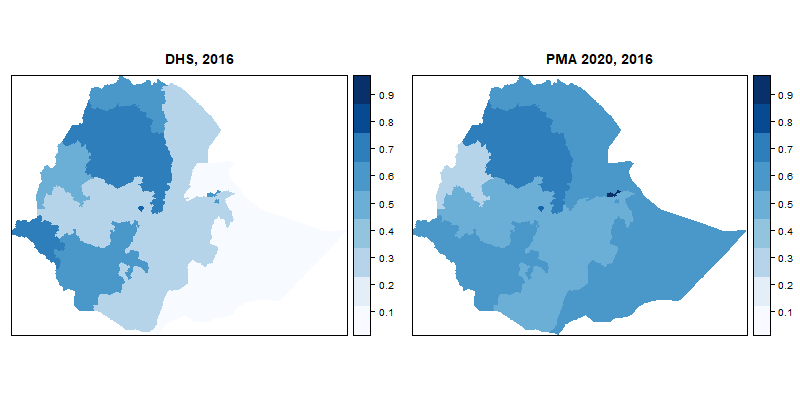
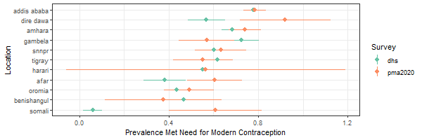
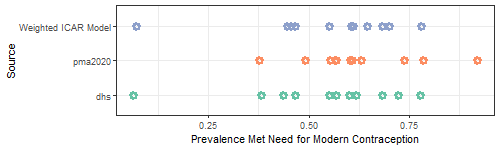
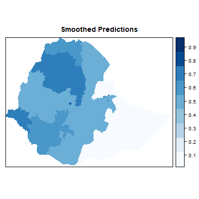

```{r setup, include=FALSE}
knitr::opts_chunk$set(echo = TRUE)
pacman::p_load(data.table, magrittr,kableExtra)
```

## Introduction

  Sustainable development target 3.7 endeavors by 2030 that countries can achieve "universal access to sexual health and reproductive services" as part of a larger goal to ensure healthy lives and promote the well-being of people of all ages and sexes. One of the key indicators for this target is 3.7.1, "the proportion of women of reproductive age (15 to 49 years) who are sexually active and have their need for family planning satisfied with modern methods." (Lozano et al, 2018) Given the concerted focus on the need for family planning by the international political, scientific, and donor communities, a number of household surveys (including but not limited to the Demographic and Health Surveys (DHS), the Multiple Indicator Cluster Surveys (MICS), and the Performance, Monitoring, and Accountability 2020 Surveys (PMA 2020)) in low and middle income countries have started to include specific series of questions to identify both the proportion of the female reproductive-age population in need of contraception as well as the proportion of that, per the target, has actually been met by modern methods available to women in higher income settings. 

  While national estimates of SDG indicator 3.7.1 are useful for high-level benchmarking, subnational estimates are sorely needed for countries with large and/or hard to reach populations in order to identify local and regional disparities. This allows for both material resources and development of programming to be focused towards the areas and populations in need of them the most. While the aforementioned household surveys tend to have subnational coverage (designed to be representative at the admin 1 level), in practice their quality significantly varies, particularly in countries with large total populations, expansive and demanding physical terrain, and nomadic groups. Ethiopia, with the Xth largest population Sub-saharan Africa, widespread mountainous and desert terrain, and dispersed nomadic populations in its eastern administrative regions, meets all three of these criteria. Oftentimes in these scenarios data collection is sporadic enough that there is only one source of estimates of an indicator at a given time, but equally problematic for policy-makers is when sources that overlap in geographic, demographic, and temporal coverage widely differ in their results. Given that the quality of individual surveys in these cases is not reliable subnational estimates of key health indicators, including SDG 3.7.1 can be derived using methods that can smooth spatial patterns to stabilize esimates in harder-to-access administrative regions with information from administrative regions with higher-quality estimates, as well as pool information from multiple disparate sources. In this analysis we attempt to generate stable region-level estimates of the prevalence of met need for modern contraception in Ethiopia in 2016, resolving inconsistencies in spatial patterns across the DHS and PMA 2020 surveys conducted in that year.

## Data Description

  Individual-level data were sourced from women's health modules of the 2016 Demographic and Health Survey and the 2016 PMA 2020 Survey conducted in all subnational regions of Ethiopia. Data for both surveys had already been extracted for analysis as part of the Global Burden of Disease study conducted by the Institute for Health Metrics and Evaluation (University of Washington). The DHS microdata are readily available for download from the DHS [website](https://dhsprogram.com/what-we-do/survey/survey-display-478.cfm), while public access to the PMA 2020 microdata is restricted and can be requested from the PMA 2020 [website](https://www.pma2020.org/request-access-to-datasets). Both surveys have multi-stage, stratified cluster based designs and are designed to be representative to the region (administrative level 1) level. Both surveys asked questions about womens' current and former cohabitation status, current and former contraceptive practices, menstrual history, childbearing history, future childbearing plans, infertility, and sexual activity, among other key demographic variables such age and education. That said, the specific format of these questions and granularity of the information captured differs between surveys. For example, the PMA 2020 survey captures numeric self-reported time since last menses, time since last sexual activity, and time desired before having another child, whereas the DHS produces binary or categorical versions of these measures. Additionally, PMA2020 captures both primary and secondary contraception methods used by an individual, whereas the DHS captures only the primary method. Both surveys in their raw format are geolocated, and individuals were mapped to their corresponding administrative regions according to the coordinates on the Ethiopia shapefile used in the analysis. While these point data could be used for more granular analyses, the scope of this preliminary analysis focuses on resolving inconsistensies between surveys at the admin 1 level. Details of the age and geographic distributions of the female childbearing age (15 to 49) populations for each survey are displayed in Appendix Table 1. 

  The admin 1 level Ethiopia shapefile used to generate the adjacency matrix for the analysis and maps of the results was sourced from the Local Burden of Disease team at IHME, but an equivalent shapefile can be generated from the `raster` package in R. The projection 'longlat WGS84' was used for the analysis.

## Methods

### Definition of Met Need for Contraception

  Prevalence of met need for modern contraception was defined primarily according to the criteria used for the analysis of progress towards SDG targets in the Global Burden of Disease study, and are detailed elsewhere (Lozano et al, 2018). 

  Briefly, women of childbearing age (15 to 49) were considered as having a need for contraception if they were 1) currently using any form of contraception or 2) fecund, sexually active, and did not want to have a child for at least two years. Women were not considered fecund and excluded from the denominator if they were pregnant, had self-reported infertility, or otherwise demonstrated indirectly that they were infertile (e.g. no previous reported use of contraception and in a union for 5 years but no reported birth history). Women were considered sexually active if they had reported sexual activity in the last month before the interview. Women who did not specify a time in which they would like to have their next child were assumed ot have a need for contraception, as they did not specify wanting a child in the near future.

  After restricting the denominator to women with an explicit need for contraception, met need for modern contraception was satisfied if women reported using any methods not considered traditional (e.g. IUDs, pills, injections, patches, and condoms, as opposed to withdrawal, periodic abstinence, and charting menstrual cycles). The final prevalence measure was calculated by survey and administrative region accounting for survey design and weighting using the `survey` package in R. This yielded a total of 22 observations (1 per survey and administrative region pair) to be incorporated into the analysis.

### Statistical Analysis

  While conducting exploratory analyses, we observed strong spatial gradients in the raw prevalences of met need that differed drastically across the two surveys and prevalences for the same administrative region that differed in magnitude and uncertainty across the two surveys (Figure 1). Accordingly, we sought to construct a model that could capture the true spatial patterns as well as incorporate information from both surveys simultaneously, accounting for differences in uncertainty as a result of the survey samples and design.

  We fit a total of five logit-normal linear models of the prevalence of met need for modern contraception utilizing Intrinsic Conditional Autoregressive (ICAR) random effects to account for spatial dependence across regions. No additional covariates were used for the analysis. One model each was fit separately on the data from DHS and PMA 2020, and three pooled models were fit -- one with and without a separate independent and identically distributed (IID) random effect to account for systematic differences between survey designs and a final model without the IID random effect in which observations were weighted by the inverse of their calculated variance to account for the effects of survey design on precision. The pooled-weighted model was used to generate the final set of results, as the source random effects were not significantly different from each other despite large observed differences between observed prevalnces in individual regions.

All analyses were run using the INLA package in R version 3.5.2. R code for all data preparation and analyses is available on [github](https://github.com/vsrini94/contraception-ethiopia).

## Results



  Figure 1 displays the raw tabulated prevalences of met need for modern contraception in administrative level 1 regions across Ethiopia in 2016 in the DHS (left) and PMA 2020 (right). The DHS demonstrates a very strong northwest-southeast gradient in prevalence, with with the remote and nomadic regions of Somali and Afar exhibiting very low levels of met need, as one would expect. The PMA 2020, on the other hand, exhibits almost no spatial gradient, and met need these less accessible regions appears comparable to the rest of the country. Examining a direct comparison of the raw estimates of met need and their uncertainty across regions (Figure 2), we observe overlap across surveys in some regions (like the capital Addis Ababa), but major discrepancies in both magnitude and precision in others (like the aforementioned Somali). The wide uncertainty can be attributed to small sample sizes after applying the exclusion criteria for the denominator of the met need indicator (Appendix Table 1).



  Applying the weighted ICAR model to the pooled data increased the variance of the prevalence across regions compared to the that of the individual raw surveys, presumably because there was a component of between region variance as well as between-survey variance (Figure 3). Prior to applying the smoothing model the between-region variance was .0392 in the DHS, .0218 in PMA 2020, and .0311 in the pooled sample, while after applying the smoothing, the between region variance was .0366. As the DHS estimates are generally more precise than those from the PMA 2020, the final estimates of the prevalence tend closer to the DHS data, and the regions with initially less precise survey estimates now have estimates that are more stable in that they incrorporate information available from both surveys. 



  Figure 4 shows the final smoothed prevalences from the pooled, weighted ICAR model. The proportion of the variance due to spatial effects was only 22% (1.6% - 84%) and demonstrably imprecise, indicating that other phenomena contribute with respect to spatial gradient that we see in the map. The capital district of Addis Ababa had the highest prevlaence of met need for modern contraception (78.0%), while the large and sparsely populated region of Somali had the lowest prevalence (7.0%). As suggested by Figure 3, the massive spread of the prevalences across region indicate opportunities for targeted intervention.



## Discussion and Limitations

  Overall, incorporating data from two disparate sources, this analysis demonstrated that met need for modern contraceptive prevalence in Ethiopia is highly heterogenous across regions, with, as expected more urbanized areas like the capital Addis Ababa showing higher met need than less accessible areas like Somali. That being said, even the best performing regions are well short of the 100% target (universal access) proposed by the SDGs, which seems quite far given the large absolute numbers of women currently in need of the modern contraceptive technologies. While targeted interventions are likely needed to close the gaps between the lowest performing regions and the best, investment is still needed across all regions in order to ensure universal access. In addition to the cross-sectional picture of prevalence of met need presented in this analysis, further work should focus on incorporating the multitude of surveys that have been conducted over time (several more DHS and PMA2020 surveys have been conducted in previous years, in addition to MICS surveys) within a more granular spatial framework to derive a better understanding of how spatially distributed inequities have changed and perhaps will continue to change over time. The GBD already makes estimates for indicator 3.7.1 at the admin 1 level in Ethiopia; however the methods used do not explicitly account for spatial correlation due to geographic proximity within the country and instead assume equal correlation between all geographic units. The Local Burden of Disease team at IHME is experimenting with geostatisitcal methods to produce surfaces for a number of indicators at the 5kmx5km pixel level, but correct estimation of the population denominator for this indicator proves extremely challenging at finer geographic detail.

  This analysis had a number of limitations. First, we focused on all-age estimates of the prevalence of met need rather than accounting for age-structure. While the latter would be useful for identifying the regions that have lower met meed above and beyond population effects, the all age framing is useful for policy makers that need to make decisions based on the sum total of all effects at play, including population. Second, while the two surveys in the analysis mostly overlapped in question topics and scope, there was loss of information (particularly from the PMA survey, which generally was more detailed) in trying to find common ground between the two to compute the appropriate numerator and denominators. This loss of information may have contributed to the small sample sizes that made it through to the calculation of the prevalence from the PMA survey and downweighted it in the final pooled modle. Third, we did not explore any relationships with covariates, though the massive uncertainty in the esitmated spatial random effect indicates that there were likely unmeasured factors without a specific spatial pattern that could explain much of the observed variation. Fourth, the surveys designed for inference at the admin 1 level, but individual observations are geolocated. Future analyses of patterns of met need at the *woreda* (admin 2 level) would be important to better understanding the nuances of variation across the entire geographic surface. Fifth, we did not experiment with any priors on the parameters of interest, instead allowing the model to fully esitmate these from the data; however, given that the model was relatively data sparse, stronger priors (particularly with respect to the spatial variation) might have been justified. Lastly, though we were able to pool estimates from multiple surveys to provide some sense of stabilities, the remoteness/inaccessibility of individuals living in regions like Afar and mean that the data themselves might not be free from selection biases, and in these cases the analysis should in some ways only be interpreted in the context of the limitations of the underlying survey instruments. 

## References

1. Lozano R, Fullman N, Abdel-Rahman O, Abdi A, Abdollahpour I, Abdulkader RS, et al. Measuring progress from 1990 to 2017 and projecting attainment to 2030 of the health-related Sustainable Development Goals for 195 countries and territories: a systematic analysis for the Global Burden of Disease Study 2017. The Lancet. 2018 Nov 10;392(10159):2091–138. 

***
## Appendix
```{r, echo = F, message = F, fig.height = 7}
knitr::kable(fread('../data/appendix_survey_pops.csv'), caption = "Survey Populations") %>% landscape() %>% kable_styling(full_width = F)

```
